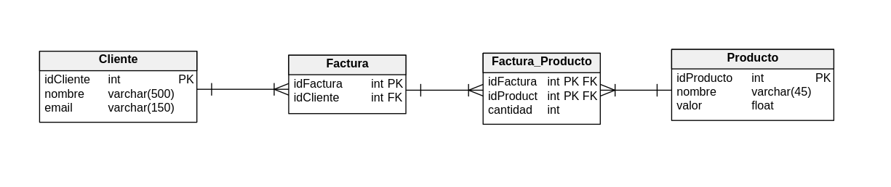
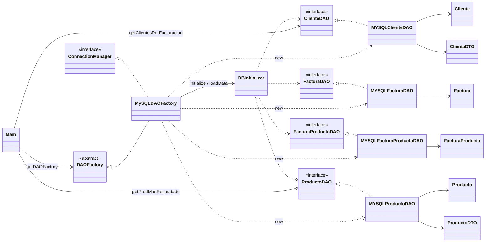

# 00-jdbc

Aplicación Java/JDBC que arma el esquema MySQL, carga datos desde CSV y resuelve las consultas de facturación del trabajo práctico integrador.

## Consignas

1. Crear el esquema de la base con JDBC.
2. Cargar los CSV con JDBC (Apache Commons CSV para la lectura).
3. Obtener el producto que más recaudó (`cantidad × valor`).
4. Listar clientes ordenados por total facturado.

## Modelo de datos

Cliente 1—N Factura; 
Factura N—N Producto vía `Factura_Producto` (cantidad).



## Arquitectura / Diagrama de clases

Paquetes bajo `app`: `Main` · `Factory` · `Data` · `DAO` · `Factory.MYSQLEntityDAO` · `Entidades` · `DTO`.



## Patrones

### DAO
Interfaces en `app.DAO`; implementaciones JDBC en `app.Factory.MYSQLEntityDAO`.  
Encapsulan el SQL por entidad; `Main` solo usa los contratos.

### Factory
`DAOFactory` (abstracta) y `MySQLDAOFactory` (concreta).  
`getDAOFactory(DBType, paths…)` devuelve la familia de DAOs MySQL sin acoplar al resto con las clases `MYSQL*`.

### Singleton
- **Factory:** `DAOFactory` cachea una instancia por `DBType` en un `HashMap` estático.
- **Conexión:** `MySQLDAOFactory` reutiliza un `Connection` estático (`createConnection` / `closeConnection`).

## Recursos

- `src/main/resources/CSV/` — `cliente.csv`, `producto.csv`, `factura.csv`, `factura-producto.csv`
- `src/main/resources/IMG/EsquemaDB.png` — modelo de datos
- `docker-compose.yml` — MySQL 8.4 para desarrollo/prueba

## Docker Compose (MySQL)

Requisito: Docker Desktop (o engine + plugin Compose).

Desde la carpeta del módulo (`00-jdbc`):

```bash
docker compose up -d
```

Queda un MySQL en `localhost:3306` alineado con `MySQLDAOFactory`:

| Parámetro | Valor |
|-----------|--------|
| contenedor | `mysql-integrador1` |
| imagen | `mysql:8.4` |
| base | `integrador1` |
| user | `root` |
| password | vacía (`MYSQL_ALLOW_EMPTY_PASSWORD`) |
| puerto | `3306:3306` |
| volumen | `mysql_data` |

Esperar a que el contenedor esté healthy/listo y correr la app (`Main` o `run.bat run`).  
El esquema y los CSV los crea/carga la propia aplicación al iniciar (no hay scripts SQL en el compose).

Comandos útiles:

```bash
docker compose ps
docker compose logs -f mysql
docker compose down          # frena y borra el contenedor (conserva el volumen)
docker compose down -v       # además borra mysql_data
```
