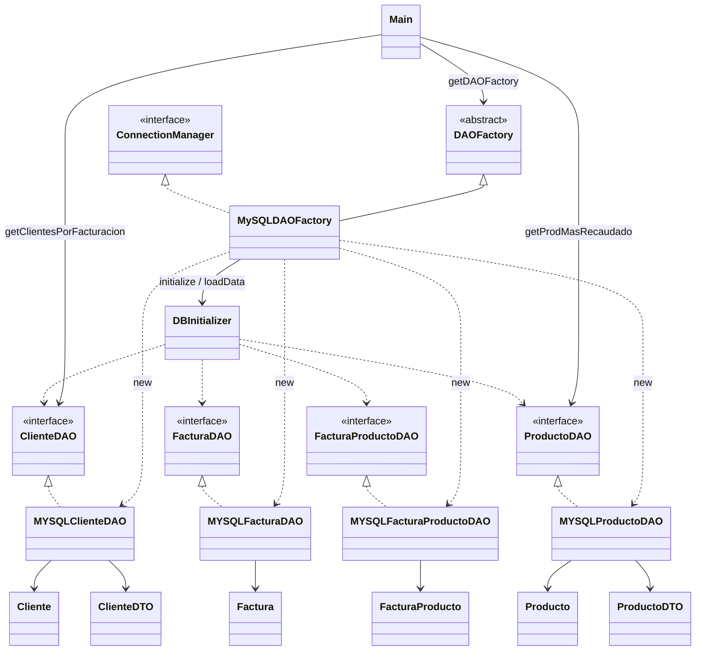

# 00-jdbc

Aplicación Java/JDBC que arma el esquema MySQL, carga datos desde CSV y resuelve las consultas de facturación del trabajo práctico integrador.

[← Volver al índice del repositorio](../../README.md)

## Consignas

1. Crear el esquema de la base con JDBC.
2. Cargar los CSV con JDBC (Apache Commons CSV para la lectura).
3. Obtener el producto que más recaudó (`cantidad × valor`).
4. Listar clientes ordenados por total facturado.

## Modelo de datos

Cliente 1—N Factura; 
Factura N—N Producto vía `Factura_Producto` (cantidad).


## Arquitectura / Diagrama de clases

Paquetes bajo `app`: `Main` · `Factory` · `Data` · `DAO` · `Factory.MYSQLEntityDAO` · `Entidades` · `DTO`.



## Patrones

El proyecto utiliza los patrones **DAO, Factory y Singleton** para separar responsabilidades, reducir el acoplamiento y centralizar la gestión del acceso a la base de datos.

### DAO

El patrón **DAO (Data Access Object)** separa la lógica de acceso a datos del resto de la aplicación. Cada entidad cuenta con una interfaz en `app.DAO` que define las operaciones disponibles, mientras que las implementaciones JDBC se encuentran en `app.Factory.MYSQLEntityDAO`.

De esta forma, las consultas SQL y la lógica de persistencia quedan encapsuladas en los DAO, mientras que el resto de la aplicación trabaja sobre sus interfaces sin depender directamente de la implementación de MySQL.

### Factory

El patrón **Factory** centraliza la creación de los DAO. `DAOFactory` define la estructura general y `MySQLDAOFactory` proporciona las implementaciones correspondientes a MySQL.

Esto permite que el resto de la aplicación solicite los DAO sin tener que conocer ni instanciar directamente las clases `MYSQL*`, reduciendo el acoplamiento y facilitando la incorporación de otros motores de base de datos.

### Singleton

Se utiliza **Singleton** para reutilizar instancias que deben ser compartidas dentro de la aplicación.

* **DAOFactory:** mantiene una única instancia de cada tipo de factory (`DBType`) mediante un `HashMap` estático, evitando crear factories repetidas.
* **Conexión:** `MySQLDAOFactory` mantiene una conexión compartida mediante `createConnection()` y `closeConnection()`, centralizando su creación y cierre.


## Cómo correr

Requisitos en la máquina de cada integrante: **JDK 17+**, **Maven 3.9+**, **MySQL** (local o `docker compose up -d`).

Desde la carpeta del módulo `00-jdbc` (CMD, PowerShell o terminal del IDE):

```bash
docker compose up -d
mvn -DskipTests compile
mvn -DskipTests compile exec:java
```

En IntelliJ: abrir el `pom.xml` como proyecto Maven, esperar el import de dependencias, Run de `app.Main`.


## Recursos

- `src/main/resources/CSV/` — `cliente.csv`, `producto.csv`, `factura.csv`, `factura-producto.csv`
- `src/main/resources/IMG/EsquemaDB.png` — modelo de datos
- `docker-compose.yml` — MySQL 8.4 para desarrollo/prueba

## Docker Compose (MySQL)

Requisito: Docker Desktop (o engine + plugin Compose).

Desde la carpeta del módulo (`00-jdbc`):

```bash
docker compose up -d
```

Queda un MySQL en `localhost:3306` alineado con `MySQLDAOFactory`:

| Parámetro | Valor |
|-----------|--------|
| contenedor | `mysql-integrador1` |
| imagen | `mysql:8.4` |
| base | `integrador1` |
| user | `root` |
| password | vacía (`MYSQL_ALLOW_EMPTY_PASSWORD`) |
| puerto | `3306:3306` |
| volumen | `mysql_data` |

Esperar a que el contenedor esté healthy/listo y correr la app (`Main` o `run.bat run`).  
El esquema y los CSV los crea/carga la propia aplicación al iniciar (no hay scripts SQL en el compose).

Comandos útiles:

```bash
docker compose ps
docker compose logs -f mysql
docker compose down          # frena y borra el contenedor (conserva el volumen)
docker compose down -v       # además borra mysql_data
```
