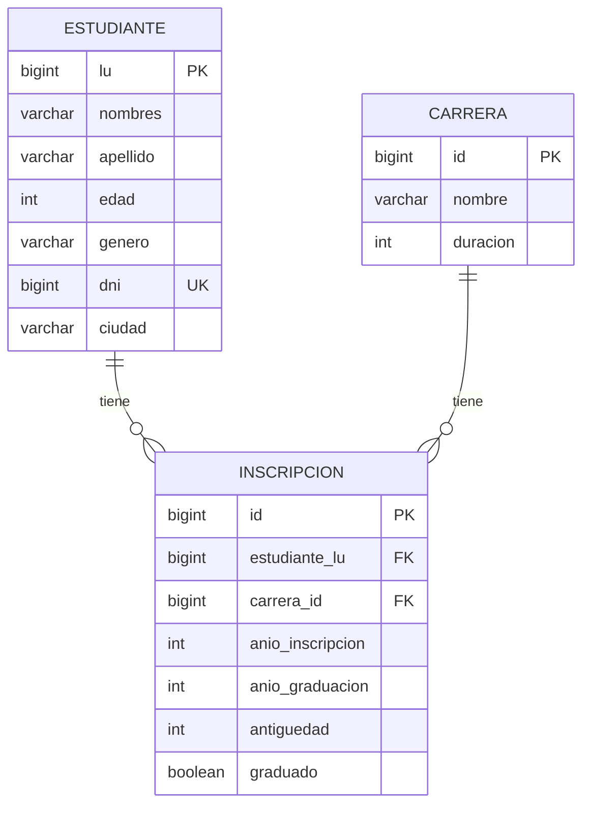
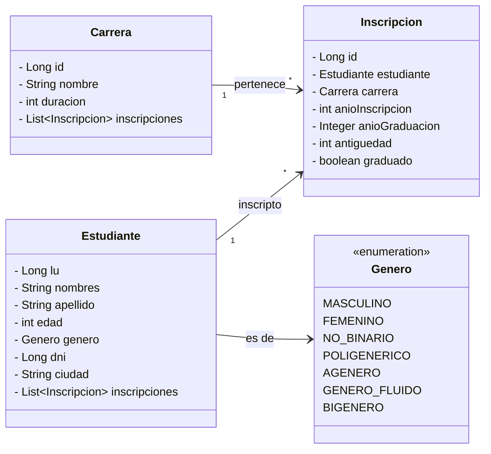
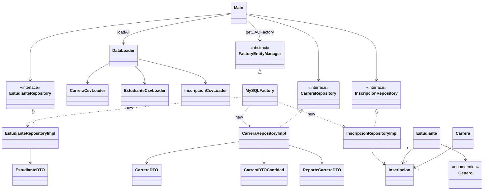

# 01-jpa

Aplicación Java/JPA que modela el registro de estudiantes y carreras, carga datos desde CSV y resuelve las consultas y el reporte del trabajo práctico.

[← Volver al índice del repositorio](../../README.md)

## Consignas

1. Diseñar el registro de estudiantes (datos personales, carreras, antigüedad y graduación) con diagrama de objetos y DER.
2. Implementar consultas para:
   - a) dar de alta un estudiante
   - b) matricular un estudiante en una carrera
   - c) recuperar todos los estudiantes con criterio de ordenamiento simple
   - d) recuperar un estudiante por número de libreta
   - e) recuperar estudiantes por género
   - f) recuperar carreras con inscriptos, ordenadas por cantidad
   - g) recuperar estudiantes de una carrera filtrados por ciudad de residencia
3. Generar un reporte de carreras con inscriptos y egresados por año (carreras alfabéticas, años cronológicos).

## Modelo de datos

Estudiante 1—N Inscripcion N—1 Carrera.  
La inscripción concentra antigüedad, años de ingreso/egreso y si está graduado. Unique `(estudiante_lu, carrera_id)`.

### DER



### Diagrama de objetos (entidades)



## Arquitectura / Diagrama de clases

Paquetes: `Main` · `factory` · `loader` · `repository` · `entity` · `dto`.



## Patrones

El proyecto utiliza los patrones **Repository, Factory y Singleton** para separar el acceso a datos, reducir el acoplamiento con el proveedor JPA y centralizar la creación del `EntityManager`.

### Repository

El patrón **Repository** encapsula las operaciones de persistencia y consulta. Cada agregado expone una interfaz en `repository` (`EstudianteRepository`, `CarreraRepository`, `InscripcionRepository`) y una implementación JPA (`*RepositoryImpl`) que usa `EntityManager` y JPQL.

El resto de la aplicación trabaja sobre las interfaces sin depender de Hibernate/MySQL de forma directa.

### Factory

`FactoryEntityManager` define la familia de repositorios y la creación del `EntityManager`. `MySQLFactory` concreta la persistence unit `MySqlPersistenceUnit` y devuelve las implementaciones MySQL/JPA.

### Singleton

`MySQLFactory` se obtiene con `getInstance()`, reutilizando un único `EntityManagerFactory` durante la ejecución.

## DataLoader

`DataLoader` centraliza la carga inicial desde CSV en una sola transacción, en orden: Carrera → Estudiante → Inscripcion.

La lectura usa Apache Commons CSV y recursos en classpath (`CSV/`). Los repositorios de consulta no dependen del loader: solo se usa al arrancar para cargar la base.

## Cómo correr

Requisitos: **JDK 17+**, **Maven 3.9+** y **Docker**.

### Desde IntelliJ IDEA

1. Abrir el `pom.xml` como proyecto Maven y esperar la carga de dependencias.
2. Desde una terminal, ubicarse dentro de la carpeta del módulo `01-jpa` y levantar el contenedor:

```bash
docker compose up -d
```

3. Ejecutar la clase `Main` desde IntelliJ IDEA.

### Desde consola

Ubicarse dentro de la carpeta del módulo `01-jpa` y ejecutar:

```bash
docker compose up -d
mvn -DskipTests compile exec:java
```

## Recursos

- `src/main/resources/CSV/` — `estudiantes.csv`, `carreras.csv`, `estudianteCarrera.csv`
- `src/main/resources/META-INF/persistence.xml` — unidad de persistencia JPA
- `docker-compose.yml` — MySQL 8.4 para desarrollo/prueba

## Docker Compose (MySQL)

Requisito: Docker Desktop (o engine + plugin Compose).

Desde la carpeta del módulo (`01-jpa`):

```bash
docker compose up -d
```

Queda un MySQL en `localhost:3306` alineado con `persistence.xml`:

| Parámetro | Valor |
|-----------|--------|
| contenedor | `mysql-integrador2` |
| imagen | `mysql:8.4` |
| base | `integrador2` |
| user | `root` |
| password | vacía (`MYSQL_ALLOW_EMPTY_PASSWORD`) |
| puerto | `3306:3306` |
| volumen | `mysql_data` |

Esperar a que el contenedor esté listo y correr la app (`Main` o `mvn exec:java`).  
El esquema lo crea Hibernate (`hbm2ddl.auto=create`) y los CSV los carga `DataLoader` al iniciar (no hay scripts SQL en el compose).

Comandos útiles:

```bash
docker compose ps
docker compose logs -f mysql
docker compose down          # frena y borra el contenedor (conserva el volumen)
docker compose down -v       # además borra mysql_data
```
