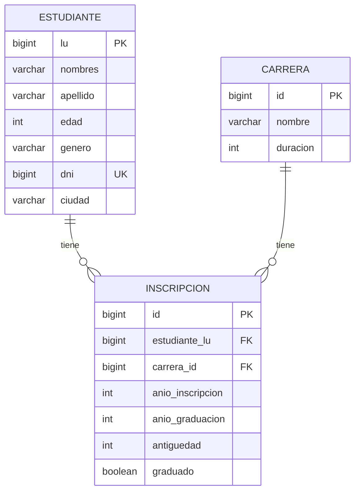
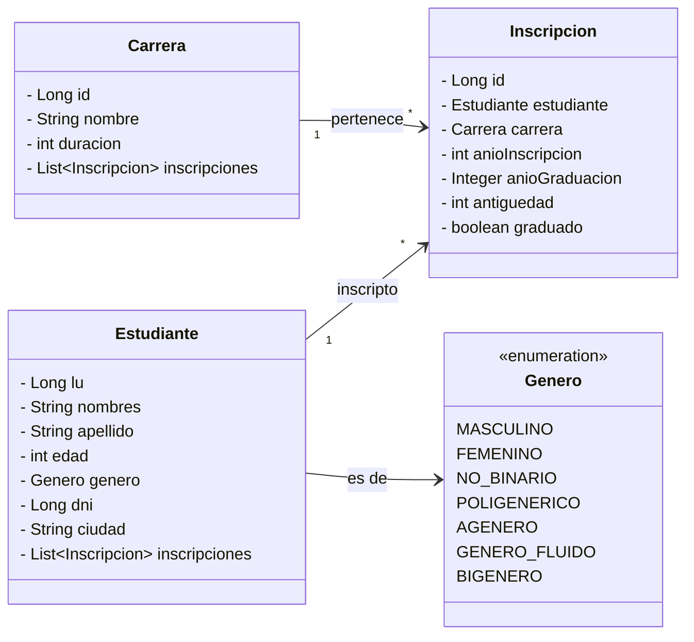
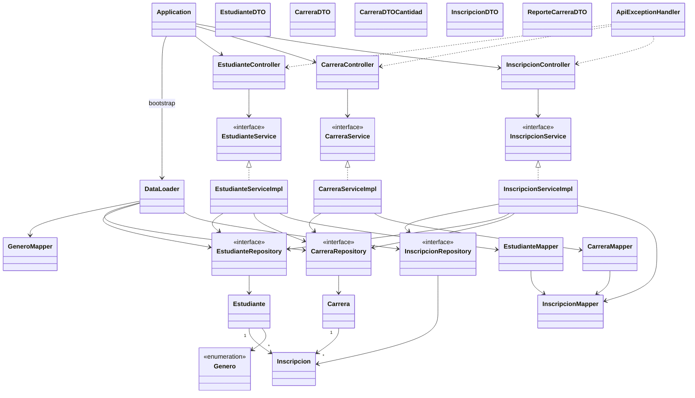

# 02-SPRING_REST

API REST Spring Boot que modela el registro de estudiantes y carreras, carga datos desde CSV y expone los servicios del trabajo práctico.

[← Volver al índice del repositorio](../README.md)

## Consignas

1. Exponer servicios REST para:
   - a) dar de alta un estudiante
   - b) matricular un estudiante en una carrera
   - c) recuperar todos los estudiantes con criterio de ordenamiento simple
   - d) recuperar un estudiante por número de libreta
   - e) recuperar estudiantes por género
   - f) recuperar carreras con inscriptos, ordenadas por cantidad
   - g) recuperar estudiantes de una carrera filtrados por ciudad de residencia
   - h) generar un reporte de carreras con inscriptos y egresados por año (carreras alfabéticas, años cronológicos)
2. Testear la invocación con Postman o cliente similar.

## Modelo de datos

Estudiante 1—N Inscripcion N—1 Carrera.  
La inscripción concentra antigüedad, años de ingreso/egreso y si está graduado. Unique `(estudiante_lu, carrera_id)`.

### DER



### Diagrama de objetos (entidades)



## Arquitectura / Diagrama de clases

Paquetes: `Application` · `loader` · `model` · `repository` · `service` · `controller` · `dto` · `mapper` · `exception`.



## Capas

El proyecto usa **Controller → Service → Repository** con **DTO + Mapper** hacia la API y **Spring Data JPA** hacia la base.

### Controller / Service / Repository

Los controllers reciben HTTP y delegan en interfaces de servicio. Las implementaciones (`*ServiceImpl`) validan reglas de negocio y usan `JpaRepository` + consultas JPQL/native. No se expone la entidad JPA en el body de la API.

### DTO y Mapper

`EstudianteDTO`, `CarreraDTO` e `InscripcionDTO` se parten en records anidados (`Create` / `Response` / `Detail` según el caso). Los mappers convierten entidad ↔ DTO. Los listados de consigna f/h usan `CarreraDTOCantidad` y `ReporteCarreraDTO`.

### Excepciones

`ApiExceptionHandler` (`@RestControllerAdvice`) traduce excepciones de dominio a HTTP (404, 409, 400).

## DataLoader

`DataLoader` (`ApplicationRunner`) carga el CSV en una sola transacción al arrancar, en orden: Carrera → Estudiante → Inscripcion.

La lectura usa Apache Commons CSV y recursos en classpath (`CSV/`). `GeneroMapper` normaliza el género del CSV. Los controllers/services de negocio no dependen del loader: solo se usa al bootstrap (guard si ya hay carreras).

## Endpoints (referencia)

Base local: `http://localhost:8080`

| Consigna | Método | Ruta | Notas |
|----------|--------|------|--------|
| a | `POST` | `/estudiantes` | body `EstudianteDTO.Create` → `201` + `Response` |
| b | `POST` | `/inscripciones/inscribir` | body `{ "estudianteLu", "carreraId" }` → `200` + `InscripcionDTO.Response` |
| c | `GET` | `/estudiantes` | query `sortBy` (default `lu`), `direction` (`asc`/`desc`) |
| d | `GET` | `/estudiantes/{lu}` | `Detail` con inscripciones |
| e | `GET` | `/estudiantes/genero/{genero}` | enum `Genero` (ej. `MASCULINO`) |
| f | `GET` | `/carreras/con_inscriptos` | `CarreraDTOCantidad`, orden por cantidad DESC |
| g | `GET` | `/estudiantes/carrera/{idCarrera}?ciudad=` | ciudad obligatoria; 404 si no existe la carrera |
| h | `GET` | `/carreras/reporte` | `ReporteCarreraDTO`: nombre, año, inscriptos, egresados |

Ejemplos:

```text
POST http://localhost:8080/estudiantes
GET  http://localhost:8080/estudiantes?sortBy=apellido&direction=desc
GET  http://localhost:8080/estudiantes/1000
GET  http://localhost:8080/estudiantes/genero/FEMENINO
GET  http://localhost:8080/estudiantes/carrera/1?ciudad=Tandil
POST http://localhost:8080/inscripciones/inscribir
GET  http://localhost:8080/carreras/con_inscriptos
GET  http://localhost:8080/carreras/reporte
```

También hay alta/actualización/baja de carrera (`POST/PUT/DELETE /carreras`) fuera de la consigna a–h.

## Cómo correr

Requisitos: **JDK 17+** y **Maven 3.9+**.

Desde la carpeta del módulo (`02-SPRING_REST`):

```bash
./mvnw -DskipTests spring-boot:run
```

o:

```bash
mvn -DskipTests spring-boot:run
```

IntelliJ: importar el `pom.xml` y Run `Application`.

Al arrancar, H2 en memoria se crea con `ddl-auto=create-drop` y `DataLoader` carga los CSV. Consola H2 habilitada en la config del módulo.

| Parámetro | Valor |
|-----------|--------|
| motor | H2 embebida |
| URL JDBC | `jdbc:h2:mem:integrador3` |
| user | `sa` |
| password | vacía |
| puerto HTTP | `8080` (default Spring) |

## Recursos

- `src/main/resources/CSV/` — `estudiantes.csv`, `carreras.csv`, `estudianteCarrera.csv`
- `src/main/resources/application.properties` — datasource H2 y JPA
- `src/main/resources/consigna.md` — extracto de consignas REST
- `pom.xml` — Spring Boot 4.1.x, Data JPA, Web, H2, Commons CSV
